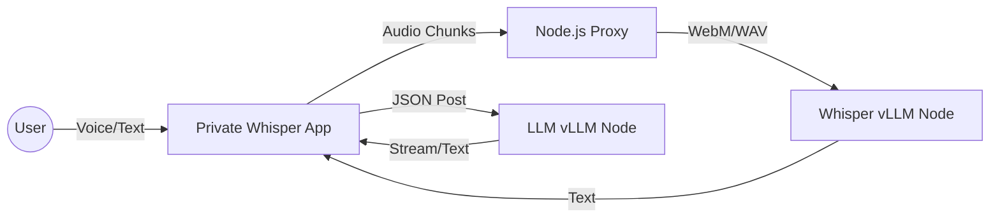

# Private Whisper Agent (Whisper Mode)

<div align="center">

🔒 **Privacy-First** | 🎙️ **Speech-to-Text** | 💬 **Intelligence Chat** | ⚡ **Fast & Local**

---

A premium, privacy-focused speech-to-text platform and intelligent chat agent. All computation happens on your private hardware.

[](https://opensource.org/licenses/MIT)
[](https://react.dev)
[](https://www.typescriptlang.org)
[](https://www.docker.com)

---

</div>

## Project Goal

**Private Whisper Agent** is built for organizations and individuals who require high-performance AI tools without sacrificing data sovereignty. It transforms raw audio into actionable intelligence through a sophisticated, Grok-inspired interface.

- **Data Sovereignty**: Your audio and chat history never leave your server.
- **Whisper Mode**: A high-tech, minimalist UI designed for speed and clarity.
- **Node Integration**: Connects directly to local vLLM and Whisper instances.

---

## 🛠 Features

### 1. Intelligence (Chat)
A voice-enabled AI chat interface. 
- **Hold-to-Talk**: Hold `SPACE` to record a voice query; release to transcribe and send.
- **Private Intelligence**: Context-aware chat using your local LLM (Qwen, Llama, etc.).
- **Markdown Support**: Rich text and code highlighting for technical queries.

### 2. Transcribe
Dedicated audio capture for long-form speech.
- **Voice-to-Clipboard**: Transcribe long recordings and copy them instantly.
- **Send to Chat**: Seamlessly move transcribed text to the Intelligence engine for further analysis.
- **Real-time Feedback**: Pulse visualizer indicates audio capture activity.

### 3. Realtime WS (WS Pipeline)
Our lowest-latency transcription stream.
- **Continuous Stream**: Audio is sent in chunks for near-instant text feedback.
- **Dynamic Correction**: Text updates as you speak to fix context-based transcription errors.

---

## 🚀 Getting Started

### Prerequisites
- **Docker & Docker Compose**
- **NVIDIA GPU** (Recommended for Whisper/vLLM performance)
- **Node.js 20+** (For local development)

### Deployment

The project is optimized for **EasyPanel** or standard **Docker Compose**.

#### Option A: Unified Stack (App + Whisper)
Build and run the entire environment in one command:
```bash
docker-compose up -d
```

#### Option B: Dedicated Pipeline (Whisper Only)
If you want to run the Whisper/vLLM server as a standalone node:
```bash
docker-compose -f docker-compose.vllm.yml up -d
```

---

## ⚙️ Configuration

Configuration is handled exclusively via environment variables. There is no manual settings UI to ensure the security of your endpoints.

| Variable | Description | Default |
|----------|-------------|---------|
| `PORT` | Web App Port | `3000` |
| `WHISPER_URL` | Endpoint for the Whisper server | `http://whisper-vllm:8001` |
| `VITE_CHAT_API_URL` | vLLM/OpenAI compatible chat API | `http://172.17.0.1:8000/v1` |
| `VITE_CHAT_MODEL_NAME` | Model ID to use for Intelligence | `autoversio` |

---

## 📐 Architecture



---

## 🛡 License

This project is licensed under the MIT License - see the [LICENSE](LICENSE) file for details.

---

## About Autoversio

**Autoversio** is a Swedish provider offering flexible AI deployment options:

- **Semi-Local Services**: Cloud-hosted in Sweden for compliance and speed.
- **Fully Local On-Prem**: Complete data sovereignty with dedicated hardware.

Managed by **[PRIVAI](https://www.privai.se)** - Private AI solutions for everyone.

---

<p align="center">
  <strong>© 2024 Magnus Froste. Built with ❤️ for the open-source community.</strong>
</p>
